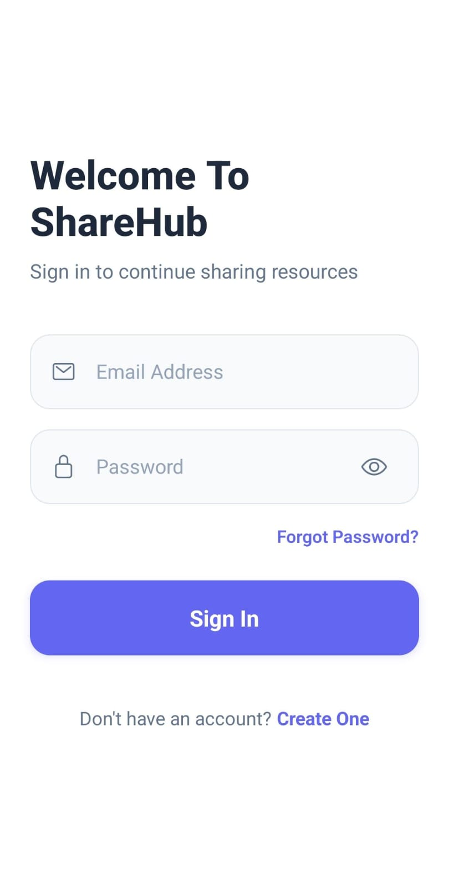
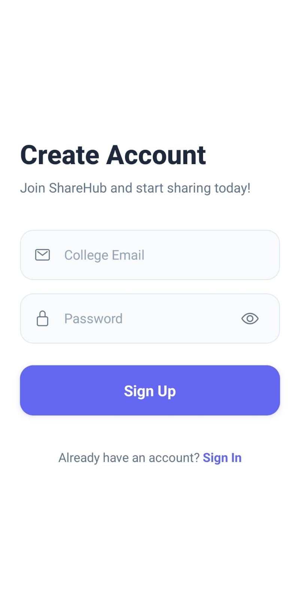
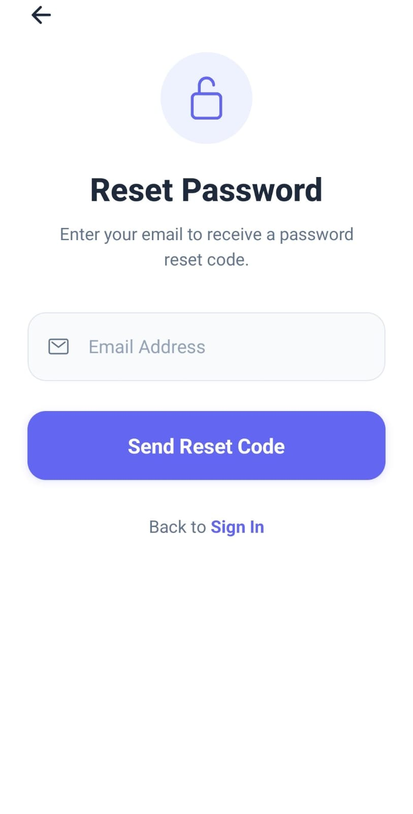
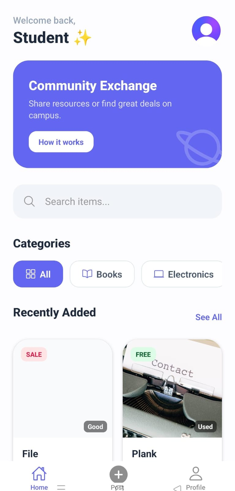
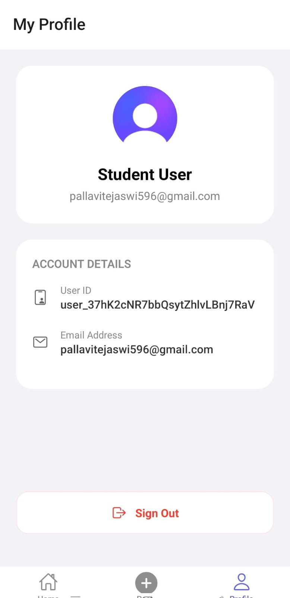

<h1>ShareHub – Community Resource Sharing App</h1>

<strong>ShareHub</strong> is a React Native mobile application built with <strong>Expo</strong> that enables authenticated users to <strong>share and request resources</strong> such as books, notes, tools, or devices within a college or community. The app uses <strong>real authentication via Clerk (Expo SDK)</strong> and implements a clean, protected navigation flow.

<h2>✨ Idea & Motivation</h2>

In colleges, students often buy items that others already own. ShareHub solves this real-world problem by encouraging <strong>resource sharing</strong> within a trusted, authenticated community.

<h3>Why ShareHub?</h3>
<ul>
  <li>♻️ Reduces unnecessary purchases</li>
  <li>🤝 Encourages sharing and collaboration</li>
  <li>🏫 Solves a real college/hostel problem</li>
  <li>🔐 Authentication ensures trust and accountability</li>
</ul>

<h2>Preview</h2>

<h3>Authentication Flow</h3>

  
  
  

<h3>Main Application</h3>

  
  
  

<h2> Features</h2>

<ul>
  <li>🔐 Secure Login & Signup using Clerk (Expo SDK)</li>
  <li>🚫 Protected routes – unauthenticated users cannot access app screens</li>
  <li>🏠 Home Screen showing available shared resources</li>
  <li>👤 Profile Screen displaying user details from Clerk</li>
  <li>🚪 Logout functionality that ends the session properly</li>
  <li>🧭 Smooth navigation using React Navigation</li>
</ul>

<h2> App Screens</h2>

<ul>
  <li><strong>Login / Signup</strong> – Secure authentication via Clerk</li>
  <li><strong>Home Screen</strong> – Displays available resources shared by users</li>
  <li><strong>Profile Screen</strong> – Shows user information and logout option</li>
</ul>

<h2>Tech Stack</h2>

<ul>
  <li><strong>React Native</strong> – Mobile app development</li>
  <li><strong>Expo (SDK 54)</strong> – Development & build tooling</li>
  <li><strong>Clerk (Expo SDK)</strong> – Authentication & user management</li>
  <li><strong>React Navigation</strong> – App navigation & screen transitions</li>
  <li><strong>TypeScript</strong> – Type safety</li>
</ul>

<h2>Installation & Setup</h2>

<h3>1️⃣ Clone the repository</h3>
<pre>
git clone https://github.com/your-username/sharehub.git
cd sharehub
</pre>

<h3>2️⃣ Install dependencies</h3>
<pre>
npm install --legacy-peer-deps
</pre>

<h3>3️⃣ Configure Clerk</h3>

Create a <code>.env</code> file in the root directory:

<pre>
EXPO_PUBLIC_CLERK_PUBLISHABLE_KEY=your_clerk_publishable_key
</pre>

You can get this key from the <strong>Clerk Dashboard</strong>.

<h2>Running the App</h2>

<pre>
npx expo start -c
</pre>

<ul>
  <li>Press <strong>a</strong> → Run on Android Emulator</li>
  <li>Scan QR code → Run on Expo Go (physical device)</li>
</ul>

<h2>Technical Considerations</h2>

<ul>
  <li>React Compiler is intentionally <strong>disabled</strong> (not supported in Expo SDK 54)</li>
  <li>Always install native packages using <code>npx expo install</code></li>
  <li>Unauthenticated users cannot access protected screens</li>
</ul>

